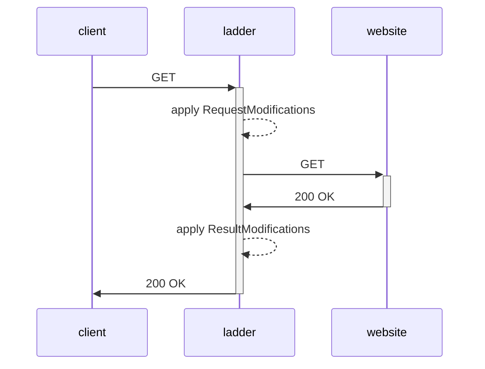

<p align="center">
    
</p>

<h1 align="center">Ladder</h1>
<div>     </div>


*Ladder is a http web proxy.* This is a selfhosted version of [1ft.io](https://1ft.io) and [12ft.io](https://12ft.io). It is inspired by [13ft](https://github.com/wasi-master/13ft).

### Why

Freedom of information is an essential pillar of democracy and informed decision-making. While media organizations have legitimate financial interests, it is crucial to strike a balance between profitability and the public's right to access information. The proliferation of paywalls raises concerns about the erosion of this fundamental freedom, and it is imperative for society to find innovative ways to preserve access to vital information without compromising the sustainability of journalism. In a world where knowledge should be shared and not commodified, paywalls should be critically examined to ensure that they do not undermine the principles of an open and informed society.

> **Disclaimer:** This project is intended for educational purposes only. The author does not endorse or encourage any unethical or illegal activity. Use this tool at your own risk.

### How it works



### Features
- [x] Bypass Paywalls
- [x] Remove CORS headers from responses, assets, and images ...
- [x] Apply domain based ruleset/code to modify response / requested URL
- [x] Keep site browsable
- [x] API
- [x] Fetch RAW HTML
- [x] Custom User Agent
- [x] Custom X-Forwarded-For IP
- [x] [Docker container](https://github.com/everywall/ladder/pkgs/container/ladder) (amd64, arm64)
- [x] Linux binary
- [x] Mac OS binary
- [x] Windows binary (untested)
- [x] Removes most of the ads (unexpected side effect ¯\\\_(ツ)_/¯ )
- [x] Basic Auth
- [x] Disable logs
- [x] No Tracking
- [x] Limit the proxy to a list of domains
- [x] Expose Ruleset to other ladders
- [x] Fetch from Google Cache
- [ ] Optional TOR proxy
- [ ] A key to share only one URL

### Limitations
Some sites do not expose their content to search engines, which means that the proxy cannot access the content. A future version will try to fetch the content from Google Cache.

Certain sites may display missing images or encounter formatting issues. This can be attributed to the site's reliance on JavaScript or CSS for image and resource loading, which presents a limitation when accessed through this proxy. If you prefer a full experience, please consider buying a subscription for the site.

## Installation

> **Warning:** If your instance will be publicly accessible, make sure to enable Basic Auth. This will prevent unauthorized users from using your proxy. If you do not enable Basic Auth, anyone can use your proxy to browse nasty/illegal stuff. And you will be responsible for it.

### Binary
1) Download binary [here](https://github.com/everywall/ladder/releases/latest)
2) Unpack and run the binary `./ladder -r https://t.ly/14PSf`
3) Open Browser (Default: http://localhost:8080)

### Docker
```bash
docker run -p 8080:8080 -d --env RULESET=https://t.ly/14PSf --name ladder ghcr.io/everywall/ladder:latest
```

### Docker Compose
```bash
curl https://raw.githubusercontent.com/everywall/ladder/main/docker-compose.yaml --output docker-compose.yaml
docker-compose up -d
```

### Helm
See [README.md](/helm-chart/README.md) in helm-chart sub-directory for more information.

## Usage

### Browser
1) Open Browser (Default: http://localhost:8080)
2) Enter URL
3) Press Enter

Or direct by appending the URL to the end of the proxy URL:
http://localhost:8080/https://www.example.com

Or create a bookmark with the following URL:
```javascript
javascript:window.location.href="http://localhost:8080/"+location.href
```

### API
```bash
curl -X GET "http://localhost:8080/api/https://www.example.com"
```

### RAW
http://localhost:8080/raw/https://www.example.com


### Running Ruleset
http://localhost:8080/ruleset

## Configuration

### Environment Variables

| Variable | Description | Value |
| --- | --- | --- |
| `PORT` | Port to listen on | `8080` |
| `PREFORK` | Spawn multiple server instances | `false` |
| `USER_AGENT` | User agent to emulate | `Mozilla/5.0 (compatible; Googlebot/2.1; +http://www.google.com/bot.html)` |
| `X_FORWARDED_FOR` | IP forwarder address | `66.249.66.1` |
| `USERPASS` | Enables Basic Auth, format `admin:123456` | `` |
| `LOG_URLS` | Log fetched URL's | `true` |
| `DISABLE_FORM` | Disables URL Form Frontpage | `false` |
| `FORM_PATH` | Path to custom Form HTML | `` |
| `RULESET` | Path or URL to a ruleset file, accepts local directories | `https://raw.githubusercontent.com/everywall/ladder-rules/main/ruleset.yaml` or `/path/to/my/rules.yaml` or `/path/to/my/rules/` |
| `EXPOSE_RULESET` | Make your Ruleset available to other ladders | `true` |
| `ALLOWED_DOMAINS` | Comma separated list of allowed domains. Empty = no limitations | `` |
| `ALLOWED_DOMAINS_RULESET` | Allow Domains from Ruleset. false = no limitations | `false` |

`ALLOWED_DOMAINS` and `ALLOWED_DOMAINS_RULESET` are joined together. If both are empty, no limitations are applied.

### Ruleset

It is possible to apply custom rules to modify the response or the requested URL. This can be used to remove unwanted or modify elements from the page. The ruleset is a YAML file, a directory with YAML Files, or an URL to a YAML file that contains a list of rules for each domain. These rules are loaded on startup.

There is a basic ruleset available in a separate repository [ruleset.yaml](https://raw.githubusercontent.com/everywall/ladder-rules/main/ruleset.yaml). Feel free to add your own rules and create a pull request.


```yaml
- domain: example.com          # Includes all subdomains
  domains:                     # Additional domains to apply the rule
    - www.example.de
    - www.beispiel.de
  headers:
    x-forwarded-for: none      # override X-Forwarded-For header or delete with none
    referer: none              # override Referer header or delete with none
    user-agent: Mozilla/5.0 (Macintosh; Intel Mac OS X 10_15_7) AppleWebKit/537.36 (KHTML, like Gecko) Chrome/119.0.0.0 Safari/537.36
    content-security-policy: script-src 'self'; # override response header
    cookie: privacy=1
  regexRules:
    - match: <script\s+([^>]*\s+)?src="(/)([^"]*)"
      replace: <script $1 script="/https://www.example.com/$3"
  injections:
    - position: head # Position where to inject the code
      append: |      # possible keys: append, prepend, replace
        <script>
          window.localStorage.clear();
          console.log("test");
          alert("Hello!");
        </script>
- domain: www.anotherdomain.com # Domain where the rule applies
  paths:                        # Paths where the rule applies
    - /article
  googleCache: false            # Use Google Cache to fetch the content
  regexRules:                   # Regex rules to apply
    - match: <script\s+([^>]*\s+)?src="(/)([^"]*)"
      replace: <script $1 script="/https://www.example.com/$3"
  injections:
    - position: .left-content article .post-title # Position where to inject the code into DOM
      replace: | 
        <h1>My Custom Title</h1>
    - position: .left-content article # Position where to inject the code into DOM
      prepend: | 
        <h2>Subtitle</h2>
- domain: demo.com
  headers:
    content-security-policy: script-src 'self';
    user-agent: Mozilla/5.0 (Macintosh; Intel Mac OS X 10_15_7) AppleWebKit/537.36 (KHTML, like Gecko) Chrome/119.0.0.0 Safari/537.36
  urlMods:              # Modify the URL
    query:              
      - key: amp        # (this will append ?amp=1 to the URL)
        value: 1 
    domain:             
      - match: www      # regex to match part of domain
        replace: amp    # (this would modify the domain from www.demo.de to amp.demo.de)
    path:               
      - match: ^        # regex to match part of path
        replace: /amp/  # (modify the url from https://www.demo.com/article/ to https://www.demo.de/amp/article/)
```

## Development

To run a development server at http://localhost:8080:

```bash
echo "dev" > handlers/VERSION
RULESET="./ruleset.yaml" go run cmd/main.go
```

### Optional: Live reloading development server with [cosmtrek/air](https://github.com/cosmtrek/air)

Install air according to the [installation instructions](https://github.com/cosmtrek/air#installation). 

Run a development server at http://localhost:8080:

```bash
air # or the path to air if you haven't added a path alias to your .bashrc or .zshrc
```

This project uses [pnpm](https://pnpm.io/) to build a stylesheet with the [Tailwind CSS](https://tailwindcss.com/) classes. For local development, if you modify styles in `form.html`, run `pnpm build` to generate a new stylesheet.
