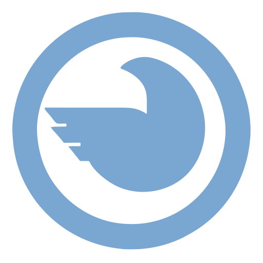
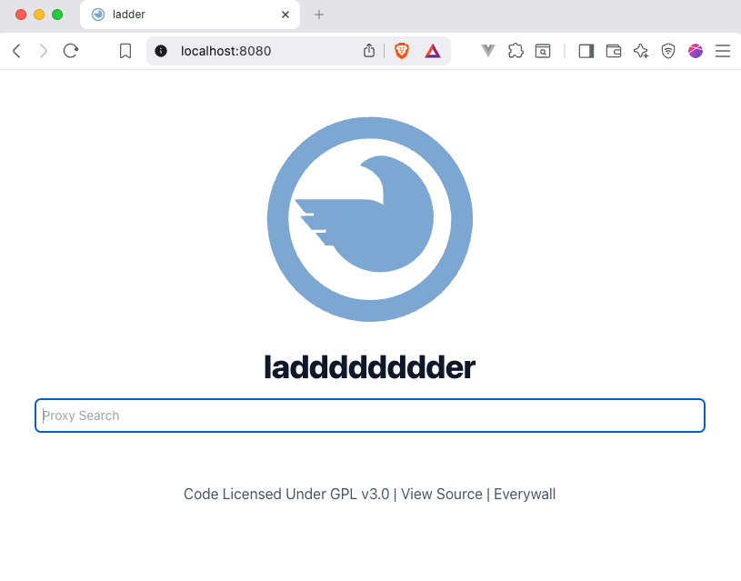
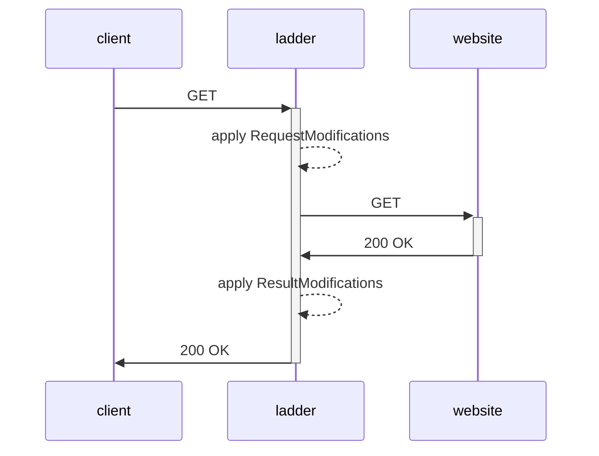

<p align="center">
    
</p>

<h1 align="center">Ladder</h1>
<div>     </div>

[English](./README.md) | 简体中文

*Ladder 是一个 HTTP 网页代理。*

Ladder 是一个面向开发者的工具，用于测试和分析现代网站上的付费墙实现与内容投放行为。

它可以帮助开发者、研究人员和发布者模拟不同的客户端环境（例如浏览器和爬虫），观察网站在不同条件下如何返回内容。这对于调试付费墙配置、验证访问控制和 HTTP 头、确认不同 User-Agent 下行为一致等场景都非常有用。

Ladder 仅用于合法的测试、研究和质量保障目的，使用时应遵守相关法律法规以及目标网站的服务条款。



### 工作原理



### 功能特性
- [x] 移除/修改响应、静态资源和图片中的 CORS 头
- [x] 移除/修改其他响应头（例如 Content-Security-Policy）
- [x] 移除/注入自定义代码（HTML、CSS、JavaScript）到页面中
- [x] 按域名应用规则集/代码，对响应或请求 URL 进行修改
- [x] 保持站点可正常浏览
- [x] 提供 API
- [x] 获取原始 HTML
- [x] 自定义 User-Agent
- [x] 自定义 X-Forwarded-For IP
- [x] [Docker 镜像](https://github.com/everywall/ladder/pkgs/container/ladder)（amd64、arm64）
- [x] Linux 二进制
- [x] macOS 二进制
- [x] Windows 二进制（未经测试）
- [x] 基本认证（Basic Auth）
- [x] 访问日志
- [x] 可能会破坏跟踪、广告和其他第三方内容
- [x] 限制代理仅作用于指定域名列表
- [x] 将自身规则集对外暴露给其他 ladder 实例
- [ ] Robots.txt 测试
- [ ] 可选 TOR 代理
- [ ] 通过密钥分享被代理的 URL

### 局限性
部分网站会根据访问客户端的类型（例如搜索引擎爬虫与普通浏览器）返回不同的内容，这种行为称为 Cloaking（内容隐藏）。Ladder 可以被配置为模拟不同的客户端类型，以便用于测试、自动化或研究等用途获取公开可访问的内容。

不过，许多网站会通过指纹识别、速率限制或行为分析等更高级的机制来限制自动化访问。Ladder 并不会绕过这类保护，在那些主动限制或管控访问的服务上可能无法正常工作。

像 FlareSolverr 这样的第三方工具可以独立用于在无头浏览器环境中渲染网页。它们并不属于 Ladder 的一部分，使用这类工具时也可能受到法律和合同方面的约束。用户需自行确保自己的使用方式符合所有适用的法规。

## 安装

> **警告：** 如果你的实例对外公开访问，请务必启用基本认证，否则任何人都可以借助你的代理浏览不当或违法内容，由此产生的责任将由你承担。

### 二进制
1) 在[此处](https://github.com/everywall/ladder/releases/latest)下载二进制文件
2) 解压后运行 `./ladder -r https://raw.githubusercontent.com/everywall/ladder-rules/main/ruleset.yaml`
3) 打开浏览器（默认地址：http://localhost:8080）

### Docker
```bash
docker run -p 8080:8080 -d --env RULESET=https://raw.githubusercontent.com/everywall/ladder-rules/main/ruleset.yaml --name ladder ghcr.io/everywall/ladder:latest
```

### Docker Compose
```bash
curl https://raw.githubusercontent.com/everywall/ladder/main/docker-compose.yaml --output docker-compose.yaml
docker-compose up -d
```

### Helm
详见 helm-chart 子目录下的 [README.md](/helm-chart/README.md)。

## 使用方法

### 浏览器
1) 打开浏览器（默认地址：http://localhost:8080）
2) 输入 URL
3) 按下回车

或者直接将 URL 拼接到代理地址末尾访问：
http://localhost:8080/https://www.example.com

也可以创建一个包含以下脚本的书签：
```javascript
javascript:window.location.href="http://localhost:8080/"+location.href
```

### API
```bash
curl -X GET "http://localhost:8080/api/https://www.example.com"
```

### RAW
http://localhost:8080/raw/https://www.example.com


### 查看运行中的规则集
http://localhost:8080/ruleset

## 配置

### 环境变量

| 变量 | 说明 | 取值 |
| --- | --- | --- |
| `PORT` | 监听端口 | `8080` |
| `PREFORK` | 启动多个服务实例 | `false` |
| `USER_AGENT` | 模拟的 User-Agent | `Mozilla/5.0 (compatible; Googlebot/2.1; +http://www.google.com/bot.html)` |
| `X_FORWARDED_FOR` | 转发的 IP 地址 | `66.249.66.1` |
| `USERPASS` | 启用基本认证，格式为 `admin:123456` | `` |
| `LOG_URLS` | 是否记录已抓取的 URL | `true` |
| `DISABLE_FORM` | 是否禁用 URL 表单首页 | `false` |
| `FORM_PATH` | 自定义表单 HTML 的路径 | `` |
| `RULESET` | 规则集文件的路径或 URL，支持本地目录 | `https://raw.githubusercontent.com/everywall/ladder-rules/main/ruleset.yaml` 或 `/path/to/my/rules.yaml` 或 `/path/to/my/rules/` |
| `EXPOSE_RULESET` | 将自身规则集对外暴露给其他 ladder 实例 | `true` |
| `ALLOWED_DOMAINS` | 允许访问的域名列表，使用逗号分隔；为空表示不限制 | `` |
| `ALLOWED_DOMAINS_RULESET` | 是否允许使用规则集中的域名；false 表示不限制 | `false` |
| `FLARESOLVERR_HOST` | 用于绕过 Cloudflare 的 FlareSolverr 服务地址（可选） | `http://localhost:8191` |

`ALLOWED_DOMAINS` 与 `ALLOWED_DOMAINS_RULESET` 会合并生效；如果两者都为空，则不施加任何限制。

### 规则集

你可以通过自定义规则修改响应内容或请求 URL，从而移除页面中不需要的元素或对其进行调整。规则集是一个 YAML 文件，也可以是包含多个 YAML 文件的目录，或者一个指向 YAML 文件的 URL，其中按域名列出了一组规则。这些规则会在启动时加载。

你可以使用一份基础规则集，它位于另一个仓库中：[ruleset.yaml](https://raw.githubusercontent.com/everywall/ladder-rules/main/ruleset.yaml)。欢迎补充自己的规则并提交 PR。


```yaml
- domain: example.com          # 包含所有子域名
  domains:                     # 同时应用规则的其他域名
    - www.example.de
    - www.beispiel.de
  headers:
    x-forwarded-for: none      # 覆盖 X-Forwarded-For 头，或用 none 删除
    referer: none              # 覆盖 Referer 头，或用 none 删除
    user-agent: Mozilla/5.0 (Macintosh; Intel Mac OS X 10_15_7) AppleWebKit/537.36 (KHTML, like Gecko) Chrome/119.0.0.0 Safari/537.36
    content-security-policy: script-src 'self'; # 覆盖响应头
    cookie: privacy=1
  regexRules:
    - match: <script\s+([^>]*\s+)?src="(/)([^"]*)"
      replace: <script $1 script="/https://www.example.com/$3"
  injections:
    - position: head # 注入代码的位置
      append: |      # 可选键：append、prepend、replace
        <script>
          window.localStorage.clear();
          console.log("test");
          alert("Hello!");
        </script>
- domain: www.anotherdomain.com # 规则生效的域名
  useFlareSolverr: false        # 是否启用 FlareSolverr 绕过 Cloudflare（可选，默认 false）
  paths:                        # 规则生效的路径
    - /article
  googleCache: false            # 是否通过 Google Cache 抓取内容
  regexRules:                   # 应用的正则规则
    - match: <script\s+([^>]*\s+)?src="(/)([^"]*)"
      replace: <script $1 script="/https://www.example.com/$3"
  injections:
    - position: .left-content article .post-title # 注入到 DOM 中的位置
      replace: | 
        <h1>My Custom Title</h1>
    - position: .left-content article # 注入到 DOM 中的位置
      prepend: | 
        <h2>Subtitle</h2>
- domain: demo.com
  headers:
    content-security-policy: script-src 'self';
    user-agent: Mozilla/5.0 (Macintosh; Intel Mac OS X 10_15_7) AppleWebKit/537.36 (KHTML, like Gecko) Chrome/119.0.0.0 Safari/537.36
  urlMods:              # 修改 URL
    query:              
      - key: amp        # （会在 URL 后追加 ?amp=1）
        value: 1 
    domain:             
      - match: www      # 匹配域名片段的正则
        replace: amp    # （会将域名从 www.demo.de 改为 amp.demo.de）
    path:               
      - match: ^        # 匹配路径片段的正则
        replace: /amp/  # （会将 URL 从 https://www.demo.com/article/ 改为 https://www.demo.de/amp/article/）
```

## FlareSolverr 集成

Ladder 现已支持与 [FlareSolverr](https://github.com/FlareSolverr/FlareSolverr) 集成，用于绕过 Cloudflare 的保护以及其他反爬虫挑战。这对于使用复杂爬虫检测机制的站点尤为有用。

### 安装 FlareSolverr

1. **使用 Docker Compose（推荐）：**
   ```yaml
   # docker-compose.yaml
   services:
     ladder:
       image: ghcr.io/everywall/ladder:latest
       ports:
         - "8080:8080"
       environment:
         - RULESET=https://raw.githubusercontent.com/everywall/ladder-rules/main/ruleset.yaml
         # - FLARESOLVERR_HOST=http://flaresolverr:8191
       depends_on:
         - flaresolverr
     
     flaresolverr:
       image: ghcr.io/flaresolverr/flaresolverr:latest
       ports:
         - "8191:8191"
       environment:
         - LOG_LEVEL=info
   ```

2. **单独运行 FlareSolverr：**
   ```bash
   docker run -d \
     --name flaresolverr \
     -p 8191:8191 \
     ghcr.io/flaresolverr/flaresolverr:latest
   ```

   然后在启动 Ladder 时指定 FlareSolverr 的地址：
   ```bash
   FLARESOLVERR_HOST=http://localhost:8191 ./ladder
   ```

### 在规则中启用 FlareSolverr

要让特定域名走 FlareSolverr，请在规则中添加 `useFlareSolverr: true`：

```yaml
# 启用了 FlareSolverr 的规则示例
- domain: cloudflare-protected-site.com
  useFlareSolverr: true  # 对该域名启用 FlareSolverr
  headers:
    user-agent: "Mozilla/5.0 (Windows NT 10.0; Win64; x64) AppleWebKit/537.36"
    accept: "text/html,application/xhtml+xml,application/xml;q=0.9,*/*;q=0.8"

# 不启用 FlareSolverr 的普通站点
- domain: regular-site.com
  headers:
    user-agent: "Custom User Agent 1.0"
```

### 适用场景

FlareSolverr 集成在以下场景中尤为有用：
- **受 Cloudflare 保护的站点**：使用 Cloudflare 反爬虫挑战的站点
- **带 JavaScript 挑战的站点**：需要执行 JavaScript 才能访问内容的页面
- **动态加载内容**：通过 JavaScript 动态加载内容的站点
- **高级爬虫检测**：使用复杂指纹识别和爬虫检测技术的站点

### 注意事项

- FlareSolverr 在解决挑战时会引入额外的请求延迟
- 仅在确实需要的域名上启用 `useFlareSolverr`，以保持整体性能
- FlareSolverr 需要更多资源，因为它会启动一个无头浏览器
- 在规则中启用 FlareSolverr 之前，请确认它已在运行并可正常访问

## 开发

启动一个本地开发服务器（http://localhost:8080）：

```bash
echo "dev" > handlers/VERSION
RULESET="./ruleset.yaml" go run cmd/main.go
```

### 可选：使用 [cosmtrek/air](https://github.com/cosmtrek/air) 启动支持热重载的开发服务器

按照 [安装说明](https://github.com/cosmtrek/air#installation) 安装 air。

启动开发服务器（http://localhost:8080）：

```bash
air # 如果没有为 air 配置路径别名，请使用 air 二进制的完整路径
```

本项目使用 [pnpm](https://pnpm.io/) 配合 [Tailwind CSS](https://tailwindcss.com/) 类构建样式表。在本地开发时，如果你修改了 `form.html` 中的样式，需要运行 `pnpm build` 来重新生成样式表。
